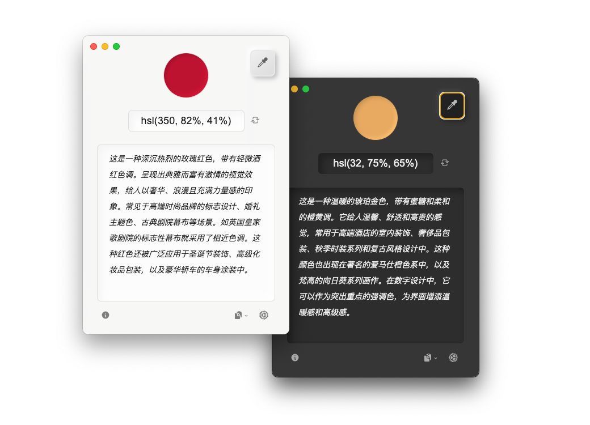

# 拾彩

> 通过 AI 生成的颜色文字描述，帮助用户（特别是色觉障碍者）理解屏幕上的颜色及其应用场景。

拾彩（ColorLift）是一款免费的跨平台辅助工具，支持 Windows 和 macOS。本项目致力于通过直观的文字描述，帮助用户更好地理解和应用色彩。*以及提供一个十分赏心悦目的用户界面。*

## 🌐 切换语言 / Language Switch / 切換語言

- **简体中文**
- [English](docs/README_EN.md)
- [繁體中文](docs/README_ZH-TW.md)

选择您偏好的语言版本以获取文档信息。  
Select your preferred language version to access the documentation.    
選擇您偏好的語言版本以獲取文檔資訊。

## 下载

可以通过 [GitHub Release 页面](https://github.com/Reedo0910/ColorLift/releases) 下载拾彩的 Windows 和 macOS 安装包与便携版压缩包。

## 特点

- 🎨 **一键拾色**：点击屏幕上的任意位置，获取对应的 HEX 颜色值。
- 🔍 **颜色识别辅助**：通过文字描述帮助用户（特别是色觉障碍者）理解颜色。
- 🌈 **语境化颜色描述**：提供颜色的常见使用场景，帮助用户更好地理解色彩在实际中的应用。
- 🌍 **多语言支持**：目前支持英文、简体中文和繁体中文，欢迎贡献其他语言的翻译或帮助纠错。
- 🤖 **多模型支持**：API 支持 Anthropic、Cohere、科大讯飞星火、OpenAI 和智谱 AI。
- 💻 **跨平台兼容**：支持 Windows 和 macOS。

## 界面

## 系统要求

- Windows 7 及以上版本
- macOS 10.11 (El Capitan) 及以上版本

## 注意

- 本应用是免费的开源工具。但调用语言模型 API 时，可能会产生由相应提供商收取的费用。请在使用前详细了解提供商的语言模型 API 资费说明。
- 所有色彩描述文本与推荐均由 AI 生成，请核查重要信息以确保准确性。
- **本工具不适用于精确色彩测量或专业色彩指导**。

## 使用前准备

使用拾彩（ColorLift）前，请确保拥有所需大语言模型（LLM）提供商的 API Key。以下是支持的厂商及其获取 API Key 的链接 （需要注册相关的开发者账号并登录）：

- **Anthropic**: [获取 API Key](https://console.anthropic.com/dashboard) | [资费说明](https://www.anthropic.com/pricing#anthropic-api)
- **Cohere**: [获取 API Key](https://dashboard.cohere.com/api-keys) | [资费说明](https://cohere.ai/pricing)
- **科大讯飞星火 (iFlytek Spark)**: [获取 API Key](https://console.xfyun.cn/services) （到控制台具体模型下获取 http 服务接口认证信息中的 APIPassword） | [资费说明](https://xinghuo.xfyun.cn/sparkapi?scr=price)
- **OpenAI**: [获取 API Key](https://platform.openai.com/api-keys) | [资费说明](https://openai.com/api/pricing/)
- **智谱 AI (Zhipu AI)**: [获取 API Key](https://open.bigmodel.cn/usercenter/proj-mgmt/apikeys) （账号设置 > 项目管理 > API keys）| [资费说明](https://open.bigmodel.cn/pricing)

### macOS 用户使用前注意

由于拾彩目前未启用代码签名（因为作为兴趣使然的个人项目，我并未支付 Apple 开发者账号的年费），因此在 macOS 上首次运行时，会触发系统的安全警告。您只需要进行一些简单的设置即可使用它，请参阅官方文档：[打开来自未知开发者的 Mac App](https://support.apple.com/guide/mac-help/mh40616/mac)。

## 使用方法

1. 在拾彩应用主界面的右下角的设置中选择语言模型的提供商与模型，并输入从相应提供商获取的 API Key （请首先确保您所在的地区与网络能够访问到该语言模型服务）。
2. 使用界面上的拾色工具（或使用自带的快捷键：Windows 默认：`ALt + D` / macOS 默认： `Option + C`）从屏幕中选取任意颜色。
3. 拾彩应用将提供并生成以下信息：
   - 颜色的 HEX 值。
   - 详细的文字描述，包括颜色的描述以及常见应用场景。例如：
    > *（示例生成自Claude 3.5 Sonnet）*
    > `#5B8FB0`:
    > 这是一种典雅的青灰蓝色，带有些许深海般的神秘感。它像是平静海面反射的天空，介于靛蓝和灰色之间，透露出成熟稳重的气质。这种颜色常见于现代简约风格的室内设计，特别适合用作主卧室或书房的墙面色彩，能营造出安宁舒适的氛围。在企业品牌设计中，它也是很受欢迎的选择，传达出专业、可靠的形象。此外，这个色调还经常出现在商务正装、高端家具和建筑外立面设计中，展现出低调优雅的格调。
4. 拾彩应用支持一键复制颜色的代码与生成的描述

## 隐私

1. **屏幕权限**：

   - 在 macOS 上，拾彩需要访问“录屏与系统录音”权限。主要用于取色功能。若不授予权限，取色将无法正常进行。（获取到的颜色与点击的屏幕区域不符。）
   - 取色时，应用仅读取鼠标指针前 1x1 像素图像内的颜色值，并将该颜色值的 HEX 文本传递给 LLM 进行解析。（除了保障隐私，这种方法也对您 API 的使用资费很友好。）

2. **LLM 的 API Key**：

   - 您的 API Key 仅存储在本地，用于调用相关模型服务。

## 支持的 LLM 列表

拾彩支持以下语言模型：

- **Anthropic**: Claude 3.5 系列
- **Cohere**: Command R 系列
- **科大讯飞星火**: Lite、Pro、Max、4.0 Ultra
- **OpenAI**: GPT-4o 系列
- **智谱 AI**: GLM-4 系列

## 常见问题 (FAQ)

1. **无法获取到某些屏幕区域的颜色（例如菜单栏或图标）？**
    
    当拾彩的鼠标点击取色不可用时，可将鼠标移到想要取色的区域上，再使用快捷键（Windows 默认：`ALt + D` / macOS 默认： `Option + C`）进行取色。

2. **macOS 显示拾彩已经获得了“录屏与系统录音”的权限，为什么还是无法正常取色？（或系统仍然提示需要获取权限？）**

    (macOS 15.0 以上版本) 请到 系统设置 > 隐私与安全性 > 录屏与系统录音 > 选中 ColorLift（拾彩） > 点击列表左下角的减号键（`-`）将 ColorLift 从权限列表中移除（可能需要输入你的系统密码进行确认） > 重新启动拾彩并授予“录屏与系统录音”权限

    其他 macOS 版本的步骤细节和界面表述可能会有些许不同。

3. **关于 Linux 的支持**

    拾彩使用 Electron 开发，原理上能够支持 Linux 。但由于我没有相关的开发环境进行适配调整和测试，所以暂时未提供 Linux 的安装包。当然，欢迎PR。

4. **关于手机系统的支持**

    拾彩不支持在手机系统上运行。但您可以透过诸如macOS上的「[iPhone 镜像](https://support.apple.com/120421)」等投屏类应用，实现从桌面端对手机屏幕取色。

5. **关于应用自动更新**

    由于经费原因，拾彩未启用代码签名。根据 Electron 官方限制，未签名的应用无法在 macOS 上提供自动更新服务。故目前拾彩未在代码层面添加任何自动更新功能。您可以在关于窗口进行手动检查更新，或直接通过 [GitHub Release 页面](https://github.com/Reedo0910/ColorLift/releases) 下载最新的版本。

6. **关于在 Windows / macOS 下窗口渲染异常**

    在测试阶段观察到拾彩可能在 Windows 或 macOS 下遇到窗口渲染异常问题。具体表现为在调整应用窗口大小、或是当系统切换深/浅色主题时，窗口背景颜色的透明度会发生异常变化。目前可通过重启应用恢复。

7. **关于取色精确度**

    由于本应用的取色原理为获取屏幕的截屏上的单个像素点色值，浏览器网页测试基本与实际色值吻合，但不排除在某些极端情况下，取色结果与实际颜色会产生有丝微偏移。该偏移对色彩描述的影响可忽略不计，但不推荐将拾彩作为专业数码测色计使用。

8. **关于更多的 功能 / 语言模型 / 设置项支持**

    我想让该应用功能和设置尽可能精简。在保持应用简单易用的原则上，暂不打算添加例如区域取色、保存取色历史等的其他复杂功能，或是其他语言模型的支持（除非某个模型相比现今应用支持的所有模型都具有非常显著优势）。
    
    因为本人精力所限，本项目将维持在可用的基础上提供基本的 BUG 修复、已有的模型版本更新与安全支持。

## 鸣谢

本项目离不开以下的开源项目：

[Electron](https://www.electronjs.org/) | [fast-average-color-node](https://github.com/fast-average-color/fast-average-color-node) | [screenshot-desktop](https://github.com/bencevans/screenshot-desktop) | [sharp](https://sharp.pixelplumbing.com/) | [simplebar](https://github.com/Grsmto/simplebar) | [electron-store](https://github.com/sindresorhus/electron-store) | [i18next](https://www.i18next.com/) 

## 许可证

[GPL-3.0 License](LICENSE)

---

拾彩的制作与设计都来自 [Zeee](https://github.com/Reedo0910)。用了很多的爱。
