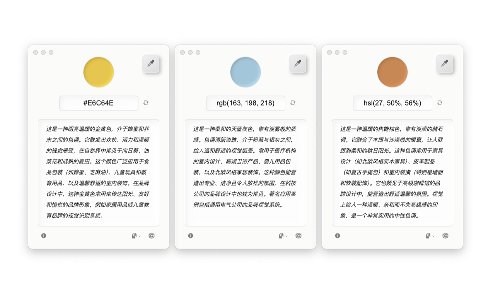

## 🌐 Translations Available

- [English](docs/README_EN.md)
- [繁體中文](docs/README_ZH-TW.md)

&nbsp;

# 拾彩

> 通过 AI 生成的颜色文字描述，帮助用户（特别是色觉障碍者）理解屏幕上的颜色及其应用场景。


**拾彩**（ColorLift）是一款免费的跨平台辅助工具，支持 Windows 和 macOS。本项目致力于通过直观的文字描述，帮助用户更好地理解和应用色彩。*以及提供一个十分赏心悦目的用户界面。*

## 下载

可以通过 **[GitHub Release 页面](https://github.com/Reedo0910/ColorLift/releases)** 下载拾彩的 Windows 和 macOS 安装包与便携版压缩包。

## 特点

- 🎨 **一键拾色**：点击屏幕上的任意位置，获取对应的 HEX/RGB/HSL 颜色值。
- 🔍 **颜色识别辅助**：通过文字描述帮助用户（特别是色觉障碍者）理解颜色。
- 🌈 **语境化颜色描述**：提供颜色的常见使用场景，帮助用户更好地理解色彩在实际中的应用。
- 🌍 **多语言支持**：目前支持英文、简体中文和繁体中文，欢迎贡献其他语言的翻译或帮助纠错。
- 🤖 **多模型支持**：API 支持 Anthropic (Claude)、Cohere、Google (Gemini)、DeepSeek、科大讯飞星火、通义千问（Qwen）、OpenAI (GPT) 和智谱 AI 的快速配置。支持自定义 API 与模型。
- 💻 **跨平台兼容**：支持 Windows 和 macOS。

## 界面预览


**支持自定义颜色描述的构成（如：颜色名称与近似色调、视觉印象、应用场景）。**

&nbsp;



**支持在 HEX、RGB 和 HSL 颜色格式之间切换。**

&nbsp;


**支持亮色/深色主题切换。**

## 系统要求

- Windows 7 及以上版本
- macOS 10.11 (El Capitan) 及以上版本

## 支持的 LLM 列表

拾彩支持以下语言模型的快速配置：

- **Anthropic**: Claude 3.7 Sonnet 与 Claude 3.5 系列
- **Cohere**: Command A 与 Command R 系列 
- **DeepSeek**: DeepSeek V3
- **Google**: Gemini 2.0 系列 与 Gemini 2.5 (Preview) 系列
- **科大讯飞星火**: Lite、Pro、Max、4.0 Ultra
- **通义千问**: Qwen 系列（商业版）
- **OpenAI**: GPT-4o 系列 与 GPT-4.1 系列
- **智谱 AI**: GLM-4 系列

**此外，拾彩还支持自定义语言模型接口，用户可以自由接入自己的语言模型 API 和指定的模型版本。**

*由于底层架构和训练数据的差异，不同语言模型生成的文本质量可能会有所不同。*

## 注意

- 本应用是免费的开源工具。但调用语言模型 API 时，可能会产生由相应提供商收取的费用。请在使用前详细了解提供商的语言模型 API 资费说明。
- 所有色彩描述文本与推荐均由 AI 生成，请核查重要信息以确保准确性。
- **本工具不适用于精确色彩测量或专业色彩指导**。

## 使用前准备

使用拾彩前，请确保拥有所需大语言模型（LLM）提供商的 API Key。以下是支持快速配置的厂商及其获取 API Key 的链接 （需要注册相关的账号）：

> 🚩（截至2025年5月14日）除 OpenAI 和 Anthropic 外，其余平台的 API 均提供免费额度（注册后可见）

- **Anthropic**: [获取 API Key](https://console.anthropic.com/dashboard) | [资费说明](https://www.anthropic.com/pricing#anthropic-api)
- **Cohere**: [获取 API Key](https://dashboard.cohere.com/api-keys) | [资费说明](https://cohere.ai/pricing)
- **DeepSeek**: [获取 API Key](https://platform.deepseek.com/api_keys)（侧边栏 > API keys > 创建 API key） | [资费说明](https://api-docs.deepseek.com/zh-cn/quick_start/pricing/)
- **Google**: [获取 API Key](https://aistudio.google.com/apikey) | [资费说明](https://ai.google.dev/gemini-api/docs/pricing)
- **科大讯飞星火**: [获取 API Key](https://console.xfyun.cn/services) （到控制台具体模型下获取 http 服务接口认证信息中的 APIPassword） | [资费说明](https://xinghuo.xfyun.cn/sparkapi?scr=price)
- **通义千问**: [获取 API Key](https://help.aliyun.com/zh/model-studio/first-api-call-to-qwen) | [资费说明](https://help.aliyun.com/zh/model-studio/models)
- **OpenAI**: [获取 API Key](https://platform.openai.com/api-keys) | [资费说明](https://openai.com/api/pricing/)
- **智谱 AI**: [获取 API Key](https://open.bigmodel.cn/usercenter/proj-mgmt/apikeys) （账号设置 > 项目管理 > API keys）| [资费说明](https://open.bigmodel.cn/pricing)

## 使用方法

1. 在拾彩应用主界面的右下角的设置中选择语言模型的提供商与模型，并输入从相应提供商获取的 API Key （请首先确保您所在的地区与网络能够访问到该语言模型服务）。
2. 使用界面上的拾色工具（或使用自带的快捷键：Windows 默认：`ALt + D` / macOS 默认： `Option + C`）从屏幕中选取任意颜色。
3. 拾彩应用将提供并生成以下信息：
   - 该颜色的 HEX、RGB 与 HSL 值。
   - 详细的文字描述，包括颜色的描述以及常见应用场景。
4. 拾彩应用支持一键复制颜色的代码与生成的描述

## macOS 用户可能会遇到的问题

### 安装应用/更新后，首次启动时显示安全警告

由于拾彩尚未启用代码签名（因为这是一个兴趣驱动的个人项目，并未支付 Apple 开发者账号年费），因此在 macOS 上首次运行时可能会触发系统的安全警告。您只需按照以下步骤设置即可正常使用：

- **Apple M 系列芯片的 macOS**：

    打开“终端”（按下`Command+Space`，搜索“终端”），然后输入以下命令并回车：

    ```bash
    sudo xattr -dr com.apple.quarantine /Applications/ColorLift.app
    ```

- **Intel 芯片的 macOS**：

    请参阅 Apple 官方文档：[打开来自未知开发者的 Mac App](https://support.apple.com/guide/mac-help/mh40616/mac)。

### 系统设置中显示拾彩已经获得了“录屏与系统录音”的权限，为什么仍然提示需要获取权限？（或为什么无法正常取色？）

**该问题通常在安装应用更新后出现，您需要重置拾彩的系统权限：**

(macOS 15.0 及以上) 请依次前往 **系统设置 > 隐私与安全性 > 录屏与系统录音**，选中 **ColorLift（拾彩）**，点击左下角的 **减号键（-）** 移除 ColorLift。随后使用拾彩取色，此时 ColorLift 会重新出现在列表中。最后，开启列表中 **ColorLift** 的权限。

其他 macOS 版本的步骤细节和界面表述可能会有些许不同。

### 为什么安装更新的过程不那么友好？

这是由于拾彩目前未启用代码签名，故每次安装（更新）后，macOS 会将其视为一个全新的程序，无法识别拾彩先前获得的权限。

如果自动获取更新的问题对您造成困扰，请在设置中关闭“应用启动时检查更新”。自行在“关于”窗口手动检查更新，或通过 [GitHub Release 页面](https://github.com/Reedo0910/ColorLift/releases) 下载最新的版本。

## 隐私

1. **屏幕权限**：

   - 在 macOS 上，拾彩需要访问“录屏与系统录音”权限。主要用于取色功能。若不授予权限，取色将无法正常进行。（获取到的颜色与点击的屏幕区域不符。）
   - 取色时，应用仅读取鼠标指针前 1x1 像素图像内的颜色值，并将该颜色值的 HEX、RGB 与 HSL 文本传递给 LLM 进行解析。（除了保障隐私，这种方法也对您 API 的使用资费很友好。）

2. **LLM 的 API Key**：

   - 您的 API Key 仅存储在本地，用于调用相关模型服务。

## 常见问题 (FAQ)

1. **无法获取到某些屏幕区域的颜色（例如菜单栏或图标）？**
   
    当拾彩的鼠标点击取色不可用时，可将鼠标移到想要取色的区域上，再使用快捷键（Windows 默认：`ALt + D` / macOS 默认： `Option + C`）进行取色。

2. **关于 Linux 的支持**

    拾彩使用 Electron 开发，原理上能够支持 Linux 。但由于我没有相关的开发环境进行适配调整和测试，所以暂时未提供 Linux 的安装包。当然，欢迎PR。

3. **关于手机系统的支持**

    拾彩不支持在手机系统上运行。但您可以透过诸如macOS上的「[iPhone 镜像](https://support.apple.com/120421)」等投屏类应用，实现从桌面端对手机屏幕取色。

4. **我应该选择哪个语言模型和版本？**

    考虑到不同用户的使用习惯和偏好，拾彩提供了多个语言模型的快速配置选项。经过测试，其实绝大多数模型都可以很好地满足拾彩本身的运行需求。

    下面是我个人的一些主观使用经验，仅供对语言模型不太熟悉的用户参考：

    - 如果只是简单了解颜色名称与色调（只勾选了默认的“名称及近似色调（必选）”）：
        - 可以选用参数较小的模型，比如 **GPT-4.1 nano**、**Qwen Turbo** 等；
        - 这类模型生成速度较快，成本也更低，适合需要频繁取色的场景。

    - 如果希望了解更丰富的颜色应用（勾选了“视觉印象”和“应用场景”）：
        - 推荐使用参数较大的模型，比如 **Claude 3.5 Sonnet**、**Qwen Max**；
        - 这类模型效果更准确，建议更有参考价值，但频繁使用的话额度消耗会相对更快。

    - **如果还是拿不定主意的话，可以先从它们开始：**
        - 从性价比角度出发，日常使用推荐：**Gemini 2.0 Flash** 或 **Qwen Plus**
        - 如果想追求最佳生成效果，推荐使用 **Claude 3.5 Sonnet**

    当然，模型的表现可能会随着时间变化和根据具体内容而有所差异，建议根据实际需求自行选择和调整。

5. **关于应用自动更新**

    由于经费原因，拾彩未启用代码签名。根据 Electron 官方限制，未签名的应用无法在 macOS 上提供自动更新服务。目前拾彩会在启动app时在后台检查更新，但需要用户手动下载更新文件并安装。您也可以在设置中禁用应用更新，并在关于窗口手动检查更新，或直接通过 [GitHub Release 页面](https://github.com/Reedo0910/ColorLift/releases) 下载最新的版本。

6. **关于取色精确度**

    由于本应用的取色原理为获取屏幕的截屏上的单个像素点色值，浏览器网页测试基本与实际色值吻合，但不排除在某些极端情况下，取色结果与实际颜色会产生有丝微偏移。该偏移对色彩描述的影响可忽略不计，但不推荐将拾彩作为专业数码测色计使用。

7. **关于更多的 功能 / 语言模型 / 设置项支持**

    我想让该应用功能和设置尽可能精简。在保持应用简单易用的原则上，暂不打算添加例如区域取色、保存取色历史等的其他复杂功能。

    由于个人精力有限，拾彩暂时无法覆盖所有主流语言模型，也可能无法及时支持最新模型版本的快速配置。用户可根据自身需求，通过自定义配置接入所需的语言模型 API 与模型版本。
    
    本项目将维持在可用的基础上提供基本的 BUG 修复与安全支持。

## 鸣谢

本项目离不开以下的开源项目：

[Electron](https://www.electronjs.org/) | [fast-average-color-node](https://github.com/fast-average-color/fast-average-color-node) | [screenshot-desktop](https://github.com/bencevans/screenshot-desktop) | [sharp](https://sharp.pixelplumbing.com/) | [simplebar](https://github.com/Grsmto/simplebar) | [electron-store](https://github.com/sindresorhus/electron-store) | [i18next](https://www.i18next.com/) 


## 许可证

[GPL-3.0 License](LICENSE)

---

拾彩的制作与设计都来自 [Zeee](https://github.com/Reedo0910)。用了很多的爱。
