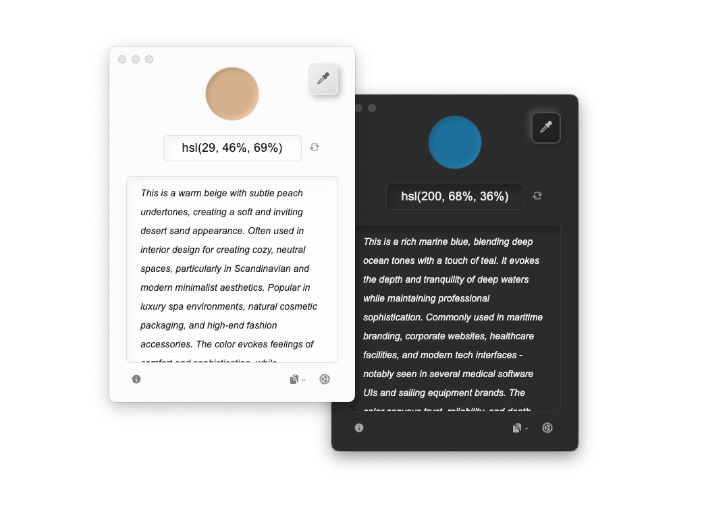

## 🌐 Translations Available (其他语言版本)

- [简体中文](/README.md)
- [繁體中文](README_ZH-TW.md)

 

# ColorLift

> AI-generated color descriptions to help users (especially those with color vision deficiencies) understand screen colors and their application contexts.


**ColorLift** is a free cross-platform accessibility tool available for Windows and macOS. This project aims to assist users in better understanding and utilizing colors through intuitive textual descriptions, all while providing a visually pleasing user interface.

## Downloads

You can download ColorLift's installation packages and portable archives for Windows and macOS from the **[GitHub Release Page](https://github.com/Reedo0910/ColorLift/releases)**.

## Features

- 🎨 **One-click Color Picking**: Click any spot on the screen to get the corresponding HEX/RGB/HSL color value.
- 🔍 **Color Recognition Assistance**: Textual descriptions help users (especially those with color vision deficiencies) understand colors.
- 🌈 **Contextual Color Descriptions**: Provides common use cases for colors, aiding in practical application.
- 🌍 **Multi-language Support**: Currently supports English, Simplified Chinese, and Traditional Chinese. Contributions for additional languages or corrections are welcome.
- 🤖 **Multi-Model Support**: The API supports quick configuration for Anthropic (Claude), Cohere, Google (Gemini), DeepSeek, iFLYTEK Spark, Tongyi Qianwen (Qwen), OpenAI (GPT), and Zhipu AI. Custom APIs and models are also supported.
- 💻 **Cross-Platform Compatibility**: Supports Windows and macOS.

## Interface Preview


**Supports customizable color description components (e.g., color name & approximate hue, visual impression, typical use cases).**

 


**Supports switching between HEX, RGB, and HSL color formats.**

 



**Supports light/dark theme switching.**

## System Requirements

- Windows 7 or later
- macOS 10.11 (El Capitan) or later

## Supported LLMs

ColorLift supports quick configuration for the following language models:

- **Anthropic**: Claude 3.7 Sonnet and Claude 3.5 series  
- **Cohere**: Command A and Command R series  
- **DeepSeek**: DeepSeek V3  
- **Google**: Gemini 2.0 series and Gemini 2.5 (Preview) series  
- **iFLYTEK Spark**: Lite, Pro, Max, and 4.0 Ultra  
- **Tongyi Qianwen**: Qwen series (commercial version)  
- **OpenAI**: GPT-4o series and GPT-4.1 series  
- **Zhipu AI**: GLM-4 series  

**Additionally, ColorLift supports custom language model endpoints, allowing users to integrate their own API and specify the model version.**

*Due to differences in underlying architecture and training data, the quality of text generated by different language models may vary.*

## Notes

- This application is a free, open-source tool. However, using language model APIs may incur fees charged by respective providers. Please refer to their pricing documentation for details.
- All color descriptions and recommendations are generated by AI. Verify critical information to ensure accuracy.
- **This tool is not intended for precise color measurement or professional color guidance.**

## Preparation Before Use

Before using ColorLift, please ensure you have an API Key from your preferred Large Language Model (LLM) provider. Below are the supported providers with links to obtain their API Keys (registration required):

> 🚩 *As of May 14, 2025, all platforms except OpenAI and Anthropic offer free usage quotas (visible after registration).*

- **Anthropic**: [Get API Key](https://console.anthropic.com/dashboard) | [Pricing](https://www.anthropic.com/pricing#anthropic-api)
- **Cohere**: [Get API Key](https://dashboard.cohere.com/api-keys) | [Pricing](https://cohere.ai/pricing)
- **DeepSeek**: [Get API Key](https://platform.deepseek.com/api_keys) (Sidebar > API Keys > Create API Key) | [Pricing](https://api-docs.deepseek.com/quick_start/pricing)
- **Google**: [Get API Key](https://aistudio.google.com/apikey) | [Pricing](https://ai.google.dev/gemini-api/docs/pricing)
- **iFlytek Spark**: [Get API Key](https://console.xfyun.cn/services) (Obtain the API Password in the HTTP service interface authentication section under the specific model) | [Pricing](https://xinghuo.xfyun.cn/sparkapi?scr=price)
- **Tongyi Qianwen**: [Get API Key](https://help.aliyun.com/en/model-studio/first-api-call-to-qwen) (ZH-CN) | [Pricing](https://help.aliyun.com/en/model-studio/models) (ZH-CN)
- **OpenAI**: [Get API Key](https://platform.openai.com/api-keys) | [Pricing](https://openai.com/api/pricing/)
- **Zhipu AI**: [Get API Key](https://open.bigmodel.cn/usercenter/proj-mgmt/apikeys) (Account Settings > Project Management > API Keys) | [Pricing](https://open.bigmodel.cn/pricing)

## How to Use

1. In the settings section at the bottom-right corner of the main interface, select your LLM provider and model, and enter the API Key from the respective provider (ensure your region and network allow access to the model service).
2. Use the color picker tool on the interface (or use the default shortcuts: Windows: `Alt + D` / macOS: `Option + C`) to select any color from the screen.
3. ColorLift will generate the following information:
   - HEX, RGB, and HSL color values.
   - A detailed textual description, including a description of the color and its common applications.
4. Copy the color code and description with a single click.


## Issues macOS Users Might Encounter

### Security Warning When Launching for the First Time After Installation/Update

Since ColorLift has not yet enabled code signing (as this is a hobby-driven personal project and the annual fee for an Apple Developer account has not been paid), macOS may trigger a security warning the first time you run the app. Follow these steps to set it up for normal use:

- **macOS with Apple M-series chip**:

   Open "Terminal" (press `Command+Space`, search for "Terminal"), then enter the following command and press Enter:

   ```bash
   sudo xattr -dr com.apple.quarantine /Applications/ColorLift.app
   ```

- **macOS with Intel chip**:

   Please refer to Apple's official documentation: [Open a Mac app from an unidentified developer](https://support.apple.com/guide/mac-help/mh40616/mac).

### Why Does System Settings Show That ColorLift Has "Screen Recording and System Audio" Permission, But It Still Prompts for Permission? (Or Why Can't I Pick Colors Properly?)

**This issue often occurs after updating the application. You need to reset ColorLift's system permissions:**

(macOS 15.0 and above) Please navigate to **System Settings > Privacy & Security > Screen Recording and System Audio**, select **ColorLift**, and click the **minus (-) button** in the lower left corner to remove ColorLift. Then, use ColorLift to pick a color. At this point, ColorLift will reappear in the list. Finally, enable the permissions for ColorLift in the list.

Steps and interface wording might vary slightly on other macOS versions.

### Why is the Installation / Update Process Not So User-Friendly?

This is because ColorLift currently does not have code signing enabled. Each time you install (or update) the app, macOS treats it as a brand-new program and does not recognize previously granted permissions.

If the automatic update process causes inconvenience, you can disable "Check updates at launch" in settings. Instead, manually check for updates via the "About" window or download the latest version from the [GitHub Release Page](https://github.com/Reedo0910/ColorLift/releases).


## Privacy

1. **Screen Access**:

   - On macOS, ColorLift requires screen recording and system audio permissions to function. Without these permissions, the color picker may not work properly.
   - During color picking, the application only reads the color value of a 1x1 pixel area under the cursor and sends the HEX, RGB, and HSL values to the LLM for processing (designed to protect privacy and minimize API usage costs).

2. **LLM API Key**:

   - Your API Key is stored locally and is used solely for calling the corresponding model service.

## FAQ

1. **Unable to pick colors from certain areas (e.g., menu bars or icons)?**

   Use the shortcut keys (Windows: `Alt + D` / macOS: `Option + C`) to pick colors from the desired area instead of clicking directly.

2. **Linux support?**

   ColorLift, built on Electron, theoretically supports Linux. However, due to the lack of a suitable development environment, Linux packages are not provided. Contributions are welcome.

3. **Mobile system support?**

   ColorLift does not support mobile OS. However, you can use screen mirroring tools (e.g., *[iPhone Mirroring](https://support.apple.com/120421)* on macOS) to pick colors from mobile screens.

4. **Which language model should I choose?**

   ColorLift offers quick configuration options for multiple language models to accommodate different user habits and preferences. Based on testing, most models perform well enough to meet ColorLift’s core functionality requirements.

   Below are some subjective recommendations for users less familiar with language models:

   - If you only need basic color names and hue information (only the default **"Name & approximate tone (required)"** is selected):
      - Consider lightweight models such as **GPT-4.1 nano** or **Qwen Turbo**.
      - These models offer faster responses and lower cost, ideal for frequent color picking scenarios.

   - If you're looking for richer color usage insights (with **"Visual impression"** and **"Typical use cases"** also selected):
      - Larger models like **Claude 3.5 Sonnet** or **Qwen Max** are recommended.
      - These provide more accurate and meaningful suggestions, but may consume quota more quickly when used frequently.

   - **Still unsure where to start? Try these first:**
      - For a good balance of performance and cost: **Gemini 2.0 Flash** or **Qwen Plus**
      - For the best overall generation quality: **Claude 3.5 Sonnet**

   Of course, model performance may vary over time and depending on the specific task, so it's best to choose and adjust based on your actual needs.


5. **Automatic updates?**

   Due to budget constraints, ColorLift does not utilize code signing. According to Electron's official limitations, unsigned applications cannot provide automatic update services on macOS. Currently, ColorLift checks for updates in the background when the app starts, but users need to manually download and install the update files. You can also disable app updates in the settings and manually check for updates in the About window, or directly download the latest version from the [GitHub Release Page](https://github.com/Reedo0910/ColorLift/releases).

6. **Color picking accuracy?**

   The color picker retrieves the color value of a single pixel from a screenshot. While accurate for most scenarios, slight deviations may occur in extreme cases. This deviation is negligible for descriptions but not suitable for professional color measurement.

7. **More features / language models / settings support?**

   I aim to keep the app as simple and streamlined as possible. In line with this principle, I currently do not plan to add more complex features such as region-based color picking or color history saving.

   Due to limited personal capacity, ColorLift may not support all mainstream language models or the latest versions right away. Users are encouraged to use the custom configuration option to integrate their preferred language model API and version as needed.

   This project will continue to provide basic bug fixes and security support to ensure usability.

## Acknowledgments

This project would not have been possible without the following open-source projects:

[Electron](https://www.electronjs.org/) | [fast-average-color-node](https://github.com/fast-average-color/fast-average-color-node) | [screenshot-desktop](https://github.com/bencevans/screenshot-desktop) | [sharp](https://sharp.pixelplumbing.com/) | [simplebar](https://github.com/Grsmto/simplebar) | [electron-store](https://github.com/sindresorhus/electron-store) | [i18next](https://www.i18next.com/)

## License

[GPL-3.0 License](LICENSE)

---

ColorLift is created and designed by [Zeee](https://github.com/Reedo0910) with lots of love.

