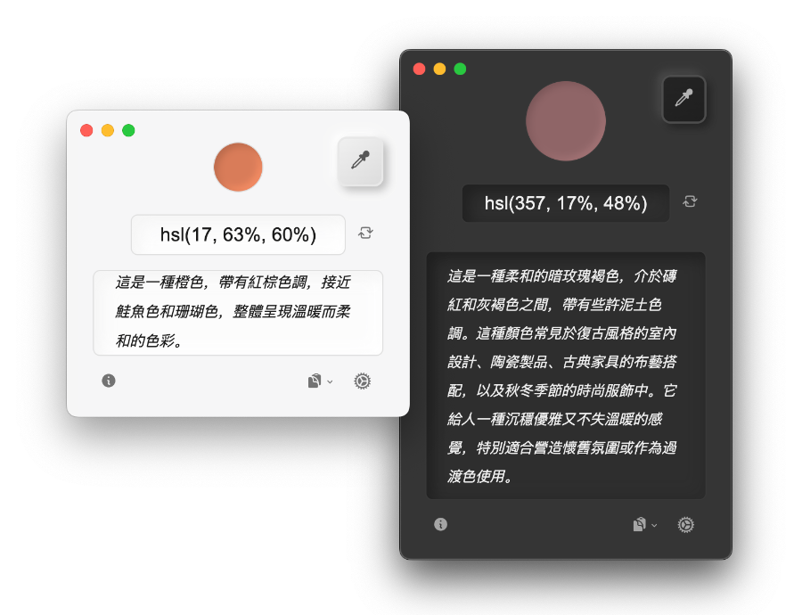
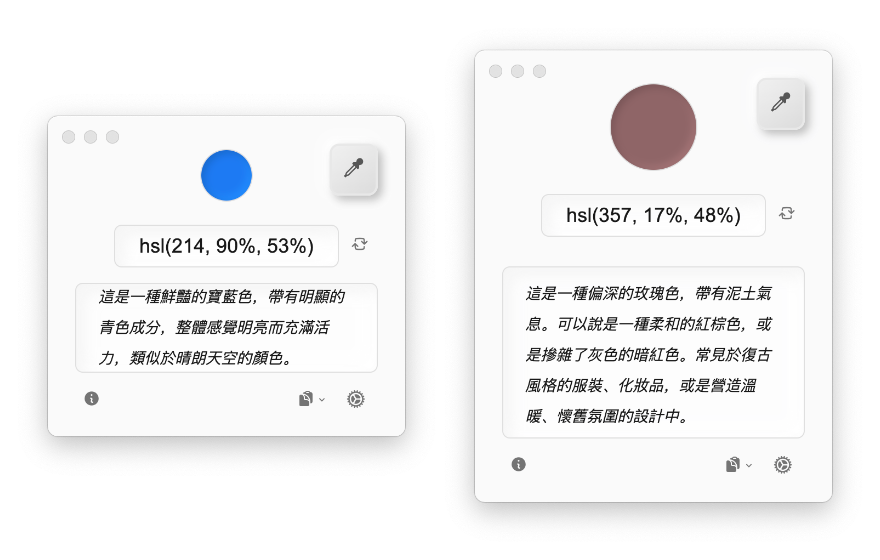
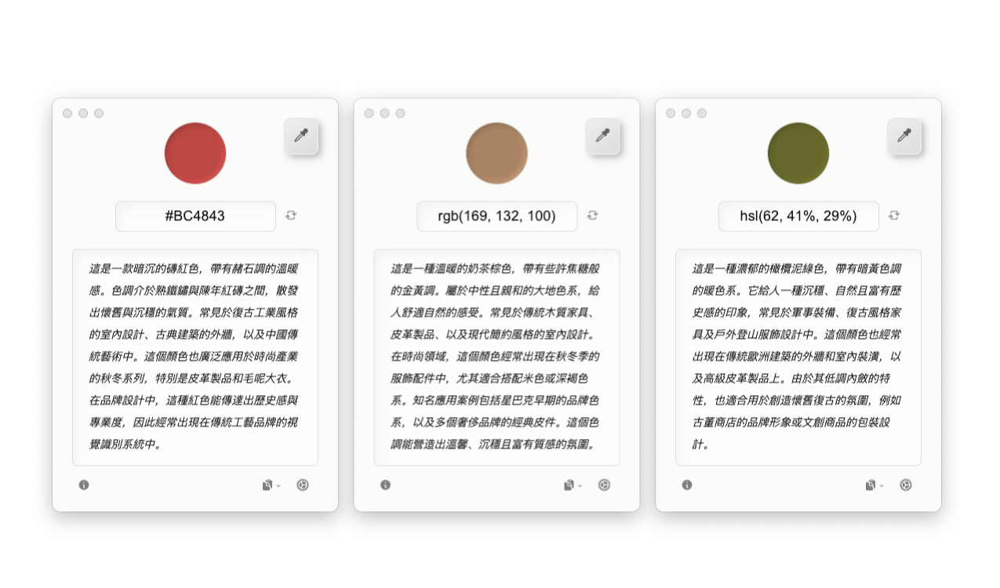

## 🌐 Translations Available

- [English](README_EN.md)
- [简体中文](/README.md)

&nbsp;

# 拾彩

> 通過 AI 生成的顏色文字描述，幫助用戶（特別是色覺障礙者）理解屏幕上的顏色及其應用場景。



**拾彩**（ColorLift）是一款免費的跨平台輔助工具，支援 Windows 和 macOS。本項目致力於通過直觀的文字描述，幫助用戶更好地理解和應用色彩。*以及提供一個十分賞心悅目的用戶介面。*

## 下載

可以通過 **[GitHub Release 頁面](https://github.com/Reedo0910/ColorLift/releases)** 下載拾彩的 Windows 和 macOS 安裝包與便攜版壓縮包。

## 特點

- 🎨 **一鍵拾色**：點擊屏幕上的任意位置，獲取對應的 HEX/RGB/HSL 顏色值。
- 🔍 **顏色識別輔助**：通過文字描述幫助用戶（特別是色覺障礙者）理解顏色。
- 🌈 **語境化顏色描述**：提供顏色的常見使用場景，幫助用戶更好地理解色彩在實際中的應用。
- 🌍 **多語言支持**：目前支持英文、簡體中文和繁體中文，歡迎貢獻其他語言的翻譯或幫助勘誤。
- 🤖 **多模型支援**：API 支援 Anthropic（Claude）、Cohere、Google（Gemini）、DeepSeek、科大訊飛星火、通義千問（Qwen）、OpenAI（GPT）與智譜 AI 的快速設定。亦支援自訂 API 與模型。
- 💻 **跨平台兼容**：支持 Windows 和 macOS。

## 界面預覽



**支援自訂顏色描述的構成（例如：顏色名稱與近似色調、視覺印象、應用場景）。**

&nbsp;



**支援在 HEX、RGB 和 HSL 顏色格式之間切換。**

&nbsp;


**支援亮色／深色主題切換。**

## 系統需求

- Windows 7 及以上版本
- macOS 10.11 (El Capitan) 及以上版本

## 支持的 LLM 清單

拾彩支援以下語言模型的快速設定：

- **Anthropic**：Claude 3.7 Sonnet 與 Claude 3.5 系列  
- **Cohere**：Command A 與 Command R 系列  
- **DeepSeek**：DeepSeek V3  
- **Google**：Gemini 2.0 系列 與 Gemini 2.5（Preview）系列  
- **科大訊飛星火**：Lite、Pro、Max、4.0 Ultra  
- **通義千問**：Qwen 系列（商業版）  
- **OpenAI**：GPT-4o 系列 與 GPT-4.1 系列  
- **智譜 AI**：GLM-4 系列

**此外，拾彩亦支援自訂語言模型接口，使用者可自由接入自己的語言模型 API 與指定的模型版本。**

*由於底層架構和訓練數據的差異，不同語言模型生成的文本質量可能會有所不同。*

## 注意

- 本應用是免費的開源工具。但調用語言模型 API 時，可能會產生由相應提供商收取的費用。請在使用前詳細了解提供商的語言模型 API 資費說明。
- 所有色彩描述文字與推薦均由 AI 生成，請核查重要資訊以確保準確性。
- **本工具不適用於精確色彩測量或專業色彩指導**。

## 使用前準備

在使用拾彩之前，請確保擁有所需大型語言模型（LLM）提供商的 API Key。以下為支援快速設定的廠商及其取得 API Key 的連結（需註冊相關帳號）：

> 🚩（截至 2025 年 5 月 14 日）除 OpenAI 與 Anthropic 外，其餘平台的 API 均提供免費額度（註冊後可見）。

- **Anthropic**: [獲取 API Key](https://console.anthropic.com/dashboard) | [資費說明](https://www.anthropic.com/pricing#anthropic-api)
- **Cohere**: [獲取 API Key](https://dashboard.cohere.com/api-keys) | [資費說明](https://cohere.ai/pricing)
- **DeepSeek**: [獲取 API Key](https://platform.deepseek.com/api_keys) （側邊欄 > API keys > 创建 API key）| [資費說明](https://api-docs.deepseek.com/zh-cn/quick_start/pricing/)
- **Google**: [獲取 API Key](https://aistudio.google.com/apikey)｜[資費說明](https://ai.google.dev/gemini-api/docs/pricing)  
- **科大訊飛星火**: [獲取 API Key](https://console.xfyun.cn/services)（前往控制台中具體模型頁面，取得 HTTP 服務接口認證資訊中的 APIPassword）｜[資費說明](https://xinghuo.xfyun.cn/sparkapi?scr=price)  
- **通義千問**: [獲取 API Key](https://help.aliyun.com/zh/model-studio/first-api-call-to-qwen)｜[資費說明](https://help.aliyun.com/zh/model-studio/models)
- **OpenAI**: [獲取 API Key](https://platform.openai.com/api-keys) | [資費說明](https://openai.com/api/pricing/)
- **智譜 AI (Zhipu AI)**: [獲取 API Key](https://open.bigmodel.cn/usercenter/proj-mgmt/apikeys) （賬號設置 > 項目管理 > API keys）| [資費說明](https://open.bigmodel.cn/pricing)

## 使用方法

1. 在拾彩應用主界面的右下角的設置中選擇語言模型的提供商與模型，並輸入從相應提供商獲取的 API Key（請首先確保您所在的地區與網絡能夠訪問到該語言模型服務）。
2. 使用介面上的拾色工具（或使用自帶的快捷鍵：Windows 預設：`ALt + D` / macOS 預設： `Option + C`）從屏幕中選取任意顏色。
3. 拾彩應用將提供並生成以下資訊：
   - 顏色的 HEX、RGB 和 HSL 值。
   - 詳細的文字描述，包括顏色的描述以及常見應用場景。
4. 拾彩應用支持一鍵複製顏色的代碼與生成的描述。


## macOS 使用者可能會遇到的問題

### 安裝應用程式/更新後，首次啟動時顯示安全警告

由於拾彩尚未啟用程式碼簽名（因為這是一個興趣驅動的個人專案，並未支付 Apple 開發者帳號年費），因此在 macOS 上首次運行時可能會觸發系統的安全警告。您只需按照以下步驟設置即可正常使用：

- **Apple M 系列晶片的 macOS**：

    開啟“終端”（按下 `Command+Space`，搜尋“終端”），然後輸入以下指令並按下回車：

    ```bash
    sudo xattr -dr com.apple.quarantine /Applications/ColorLift.app
    ```

- **Intel 晶片的 macOS**：

    請參閱 Apple 官方文件：[開啟來自未知開發者的 Mac App](https://support.apple.com/guide/mac-help/mh40616/mac)。

### 系統設定中顯示拾彩已經獲得了「螢幕錄影與系統錄音」的權限，為什麼仍然提示需要獲取權限？（或為什麼無法正常取色？）

**該問題通常在安裝應用程式更新後出現，您需要重置拾彩的系統權限：**

(macOS 15.0 及以上) 請依次前往 **系統設定 > 隱私與安全性 > 螢幕錄製與系統錄音**，選中 **ColorLift（拾彩）**，並點擊左下角的 **減號按鈕（-）** 移除 ColorLift。隨後使用拾彩取色，此時 ColorLift 會重新出現在列表中。最後，開啟列表中 **ColorLift** 的權限。

其他 macOS 版本的步驟細節和介面表述可能會有些許不同。

### 為什麼安裝與更新的過程不那麼友善？

這是由於拾彩目前未啟用程式簽署，因此每次安裝（或更新）後，macOS 會將其視為一個全新的程式，無法識別拾彩先前獲得的權限。

如果自動獲取更新的問題對您造成困擾，請在設定中關閉「應用程式啟動時檢查更新」。自行在「關於」視窗手動檢查更新，或通過 [GitHub Release 頁面](https://github.com/Reedo0910/ColorLift/releases) 下載最新的版本。


## 隱私

1. **屏幕權限**：

   - 在 macOS 上，拾彩需要訪問“錄屏與系統錄音”權限。主要用於取色功能。若不授予權限，取色將無法正常進行。（獲取到的顏色與點擊的屏幕區域不符。）
   - 取色時，應用僅讀取鼠標指針前 1x1 像素圖像內的顏色值，並將該顏色值的 HEX、RGB 和 HSL 文本傳遞給 LLM 進行解析。（除了保障隱私，這種方法也對您 API 的使用資費很友好。）

2. **LLM 的 API Key**：

   - 您的 API Key 僅存儲在本地，用於調用相關模型服務。

## 常見問題 (FAQ)

1. **無法獲取到某些屏幕區域的顏色（例如菜單欄或圖標）？**
    
    當拾彩的鼠標點擊取色不可用時，可將鼠標移到想要取色的區域上，再使用快捷鍵（Windows 預設：`ALt + D` / macOS 預設： `Option + C`）進行取色。

2. **關於 Linux 的支持**

    拾彩使用 Electron 開發，原理上能夠支持 Linux 。但由於我沒有相關的開發環境進行適配調整和測試，所以暫時未提供 Linux 的安裝包。當然，歡迎PR。

3. **關於手機系統的支持**

    拾彩不支持在手機系統上運行。但您可以透過諸如macOS上的「[iPhone 鏡像](https://support.apple.com/120421)」等投屏類應用，實現從桌面端對手機屏幕取色。

4. **我應該選擇哪個語言模型與版本？**

    考量到不同使用者的習慣與偏好，拾彩提供了多種語言模型的快速設定選項。經過測試，大多數模型其實都能良好支援拾彩的基本運行需求。

    以下是我個人的一些主觀使用經驗，僅供對語言模型不太熟悉的使用者參考：

    - 若只是單純了解顏色名稱與色調（僅勾選預設的「名稱及近似色調（必選）」）：
        - 可選用參數較小的模型，如 **GPT-4.1 nano**、**Qwen Turbo** 等；
        - 此類模型生成速度較快、成本較低，適合需要頻繁取色的情境。

    - 若希望獲得更豐富的顏色應用建議（勾選了「視覺印象」與「應用情境」）：
        - 建議使用參數較大的模型，如 **Claude 3.5 Sonnet**、**Qwen Max**；
        - 此類模型建議更具參考價值，但若頻繁使用，配額消耗也相對較快。

    - **若仍無法決定，可先從以下模型開始嘗試：**
        - 以性價比為考量，日常使用推薦：**Gemini 2.0 Flash** 或 **Qwen Plus**  
        - 若追求最佳生成品質，推薦使用：**Claude 3.5 Sonnet**

    當然，不同模型的表現可能會隨時間與具體任務而異，建議依實際需求靈活選擇與調整。

5. **關於應用自動更新**

    由於經費原因，拾彩未啟用程式簽名。根據 Electron 官方限制，未簽名的應用程式無法在 macOS 上提供自動更新服務。目前拾彩會在啟動應用程式時在背景檢查更新，但需要使用者手動下載更新檔案並安裝。您也可以在設定中停用應用程式更新，並在關於視窗手動檢查更新，或直接通過 [GitHub Release 頁面](https://github.com/Reedo0910/ColorLift/releases) 下載最新版本。

6. **關於取色精確度**

    由於本應用的取色原理為獲取屏幕的截屏上的單個像素點色值，瀏覽器網頁測試基本與實際色值吻合，但不排除在某些極端情況下，取色結果與實際顏色會產生有絲微偏移。該偏移對色彩描述的影響可忽略不計，但不推薦將拾彩作為專業數碼測色計使用。

7. **關於更多的 功能 / 語言模型 / 設置項支持**

    我希望讓此應用的功能與設定盡可能簡潔。在維持簡單易用的前提下，暫無計劃加入區域取色、保存取色歷史等其他複雜功能。

    由於個人精力有限，拾彩暫時無法涵蓋所有主流語言模型，也可能無法即時支援最新模型版本的快速設定。使用者可依自身需求，自行透過自訂設定接入所需的語言模型 API 與版本。

    本專案將維持在可用的基礎上，提供基本的 BUG 修復與安全支援。

## 鳴謝

本項目離不開以下的開源項目：

[Electron](https://www.electronjs.org/) | [fast-average-color-node](https://github.com/fast-average-color/fast-average-color-node) | [screenshot-desktop](https://github.com/bencevans/screenshot-desktop) | [sharp](https://sharp.pixelplumbing.com/) | [simplebar](https://github.com/Grsmto/simplebar) | [electron-store](https://github.com/sindresorhus/electron-store) | [i18next](https://www.i18next.com/)

## 授權

[GPL-3.0 License](LICENSE)

---

拾彩的製作與設計都來自 [Zeee](https://github.com/Reedo0910)。用了很多的愛。

