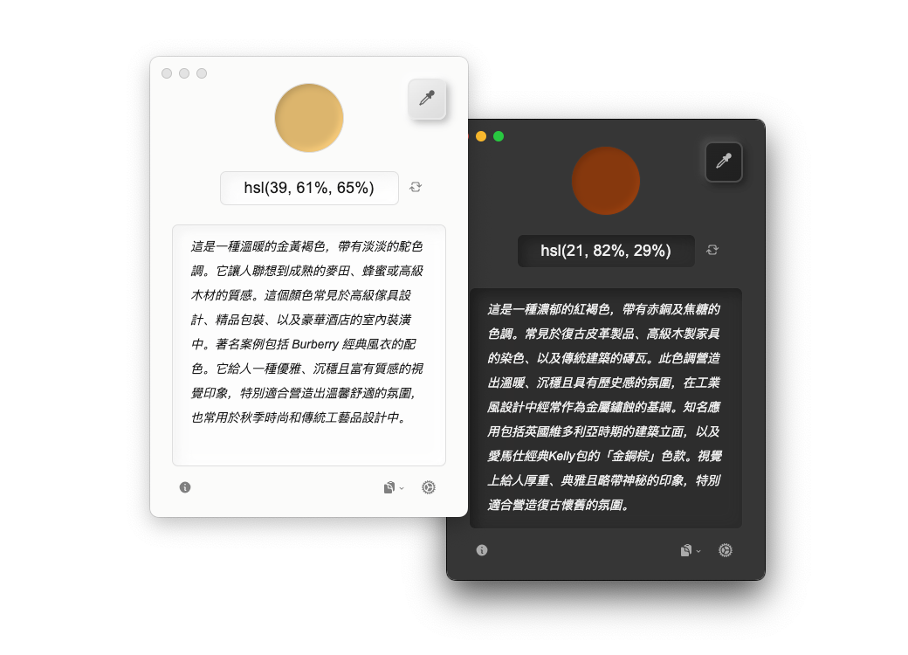

# 拾彩

> 通過 AI 生成的顏色文字描述，幫助用戶（特別是色覺障礙者）理解屏幕上的顏色及其應用場景。

拾彩（ColorLift）是一款免費的跨平台輔助工具，支援 Windows 和 macOS。本項目致力於通過直觀的文字描述，幫助用戶更好地理解和應用色彩。*以及提供一個十分賞心悅目的用戶介面。*

## 🌐 切換語言 / Language Switch / 切换语言

- **繁體中文**
- [English](docs/README_EN.md)
- [簡體中文](/README.md)

選擇您偏好的語言版本以獲取文檔資訊。  
Select your preferred language version to access the documentation.  
选择您偏好的语言版本以获取文档信息。  

## 下載

可以通過 [GitHub Release 頁面](https://github.com/Reedo0910/ColorLift/releases) 下載拾彩的 Windows 和 macOS 安裝包與便攜版壓縮包。

## 特點

- 🎨 **一鍵拾色**：點擊屏幕上的任意位置，獲取對應的 HEX 顏色值。
- 🔍 **顏色識別輔助**：通過文字描述幫助用戶（特別是色覺障礙者）理解顏色。
- 🌈 **語境化顏色描述**：提供顏色的常見使用場景，幫助用戶更好地理解色彩在實際中的應用。
- 🌍 **多語言支持**：目前支持英文、簡體中文和繁體中文，歡迎貢獻其他語言的翻譯或幫助勘誤。
- 🤖 **多模型支持**：API 支持 Anthropic、Cohere、科大訊飛星火、OpenAI 和智譜 AI。
- 💻 **跨平台兼容**：支持 Windows 和 macOS。

## 介面

## 系統需求

- Windows 7 及以上版本
- macOS 10.11 (El Capitan) 及以上版本

## 注意

- 本應用是免費的開源工具。但調用語言模型 API 時，可能會產生由相應提供商收取的費用。請在使用前詳細了解提供商的語言模型 API 資費說明。
- 所有色彩描述文字與推薦均由 AI 生成，請核查重要資訊以確保準確性。
- **本工具不適用於精確色彩測量或專業色彩指導**。

## 使用前準備

使用拾彩（ColorLift）前，請確保擁有所需大語言模型（LLM）提供商的 API Key。以下是支持的廠商及其獲取 API Key 的連結（需要註冊相關的開發者賬號並登錄）：

- **Anthropic**: [獲取 API Key](https://console.anthropic.com/dashboard) | [資費說明](https://www.anthropic.com/pricing#anthropic-api)
- **Cohere**: [獲取 API Key](https://dashboard.cohere.com/api-keys) | [資費說明](https://cohere.ai/pricing)
- **科大訊飛星火 (iFlytek Spark)**: [獲取 API Key](https://console.xfyun.cn/services) （到控制台具體模型下獲取 http 服務接口認證資訊中的 APIPassword） | [資費說明](https://xinghuo.xfyun.cn/sparkapi?scr=price)
- **OpenAI**: [獲取 API Key](https://platform.openai.com/api-keys) | [資費說明](https://openai.com/api/pricing/)
- **智譜 AI (Zhipu AI)**: [獲取 API Key](https://open.bigmodel.cn/usercenter/proj-mgmt/apikeys) （賬號設置 > 項目管理 > API keys）| [資費說明](https://open.bigmodel.cn/pricing)

### macOS 用戶使用前注意

由於拾彩目前未啟用代碼簽名（因為作為興趣使然的個人項目，我並未支付 Apple 開發者賬號的年費），因此在 macOS 上首次運行時，會觸發系統的安全警告。您只需要進行一些簡單的設置即可使用它，請參閱官方文件：[打開來自未知開發者的 Mac App](https://support.apple.com/guide/mac-help/mh40616/mac)。

## 使用方法

1. 在拾彩應用主界面的右下角的設置中選擇語言模型的提供商與模型，並輸入從相應提供商獲取的 API Key（請首先確保您所在的地區與網絡能夠訪問到該語言模型服務）。
2. 使用介面上的拾色工具（或使用自帶的快捷鍵：Windows 預設：`ALt + D` / macOS 預設： `Option + C`）從屏幕中選取任意顏色。
3. 拾彩應用將提供並生成以下資訊：
   - 顏色的 HEX 值。
   - 詳細的文字描述，包括顏色的描述以及常見應用場景。例如：
    > *（示例生成自Claude 3.5 Sonnet）*
    > `#5B8FB0`:
    > 這是一種典雅的青灰藍色，帶有些許深海般的神秘感。它像是平靜海面反射的天空，介於靛藍和灰色之間，透露出成熟穩重的氣質。這種顏色常見於現代簡約風格的室內設計，特別適合作為主臥室或書房的牆面色彩，能營造出安寧舒適的氛圍。在企業品牌設計中，它也是很受歡迎的選擇，傳達出專業、可靠的形象。此外，這個色調還經常出現在商務正裝、高端家具和建築外立面設計中，展現出低調優雅的格調。
4. 拾彩應用支持一鍵複製顏色的代碼與生成的描述。

## 隱私

1. **屏幕權限**：

   - 在 macOS 上，拾彩需要訪問“錄屏與系統錄音”權限。主要用於取色功能。若不授予權限，取色將無法正常進行。（獲取到的顏色與點擊的屏幕區域不符。）
   - 取色時，應用僅讀取鼠標指針前 1x1 像素圖像內的顏色值，並將該顏色值的 HEX 文本傳遞給 LLM 進行解析。（除了保障隱私，這種方法也對您 API 的使用資費很友好。）

2. **LLM 的 API Key**：

   - 您的 API Key 僅存儲在本地，用於調用相關模型服務。

## 支持的 LLM 清單

拾彩支持以下語言模型：

- **Anthropic**: Claude 3.5 系列
- **Cohere**: Command R 系列
- **科大訊飛星火**: Lite、Pro、Max、4.0 Ultra
- **OpenAI**: GPT-4o 系列
- **智譜 AI**: GLM-4 系列

## 常見問題 (FAQ)

1. **無法獲取到某些屏幕區域的顏色（例如菜單欄或圖標）？**
    
    當拾彩的鼠標點擊取色不可用時，可將鼠標移到想要取色的區域上，再使用快捷鍵（Windows 預設：`ALt + D` / macOS 預設： `Option + C`）進行取色。

2. **macOS 顯示拾彩已經獲得了“錄屏與系統錄音”的權限，為什麼還是無法正常取色？（或系統仍然提示需要獲取權限？）**

    (macOS 15.0 以上版本) 請到 系統設置 > 隱私與安全性 > 錄屏與系統錄音 > 選中 ColorLift（拾彩） > 點擊清單左下角的減號鍵（`-`）將 ColorLift 從權限清單中移除（可能需要輸入你的系統密碼進行確認） > 重新啟動拾彩並授予“錄屏與系統錄音”權限。

    其他 macOS 版本的步驟細節和界面表述可能會有些許不同。

3. **關於 Linux 的支持**

    拾彩使用 Electron 開發，原理上能夠支持 Linux 。但由於我沒有相關的開發環境進行適配調整和測試，所以暫時未提供 Linux 的安裝包。當然，歡迎PR。

4. **關於手機系統的支持**

    拾彩不支持在手機系統上運行。但您可以透過諸如macOS上的「[iPhone 鏡像](https://support.apple.com/120421)」等投屏類應用，實現從桌面端對手機屏幕取色。

5. **關於應用自動更新**

    由於經費原因，拾彩未啟用代碼簽名。根據 Electron 官方限制，未簽名的應用無法在 macOS 上提供自動更新服務。故目前拾彩未在代碼層面添加任何自動更新功能。您可以在關於窗口進行手動檢查更新，或直接通過 [GitHub Release 頁面](https://github.com/Reedo0910/ColorLift/releases) 下載最新的版本。

6. **關於在 Windows / macOS 下窗口渲染異常**

    在測試階段觀察到拾彩可能在 Windows 或 macOS 下遇到窗口渲染異常問題。具體表現為在調整應用窗口大小、或是當系統切換深/淺色主題時，窗口背景顏色的透明度會發生異常變化。目前可通過重啟應用恢復。

7. **關於取色精確度**

    由於本應用的取色原理為獲取屏幕的截屏上的單個像素點色值，瀏覽器網頁測試基本與實際色值吻合，但不排除在某些極端情況下，取色結果與實際顏色會產生有絲微偏移。該偏移對色彩描述的影響可忽略不計，但不推薦將拾彩作為專業數碼測色計使用。

8. **關於更多的 功能 / 語言模型 / 設置項支持**

    我想讓該應用功能和設置儘可能精簡。在保持應用簡單易用的原則上，暫不打算添加例如區域取色、保存取色歷史等的其他複雜功能，或是其他語言模型的支持（除非某個模型相比現今應用支持的所有模型都具有非常顯著優勢）。
    
    因為本人精力所限，本項目將維持在可用的基礎上提供基本的 BUG 修復、已有的模型版本更新與安全支持。

## 鳴謝

本項目離不開以下的開源項目：

[Electron](https://www.electronjs.org/) | [fast-average-color-node](https://github.com/fast-average-color/fast-average-color-node) | [screenshot-desktop](https://github.com/bencevans/screenshot-desktop) | [sharp](https://sharp.pixelplumbing.com/) | [simplebar](https://github.com/Grsmto/simplebar) | [electron-store](https://github.com/sindresorhus/electron-store) | [i18next](https://www.i18next.com/)

## 授權

[GPL-3.0 License](LICENSE)

---

拾彩的製作與設計都來自 [Zeee](https://github.com/Reedo0910)。用了很多的愛。

